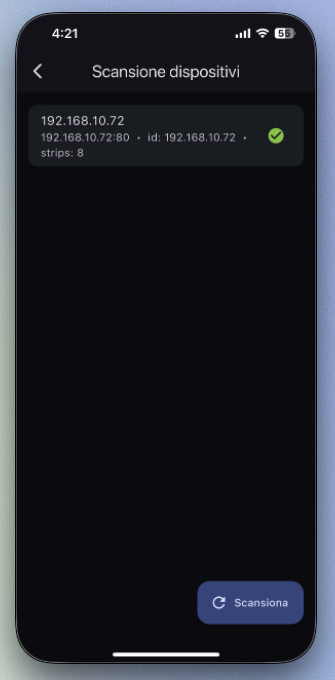

[![Contributors][contributors-shield]][contributors-url]
[![Forks][forks-shield]][forks-url]
[![Stargazers][stars-shield]][stars-url]
[![Issues][issues-shield]][issues-url]
[![MIT License][license-shield]][license-url]

<!-- PROJECT LOGO --> <div align="center"> <a href="https://github.com/zehmsy/LightFlow">  </a> <h3 align="center">LightFlow</h3> <p align="center"> Flutter controller + Arduino firmware for multi-strip <strong>WS2812B</strong> LED rigs.<br> Zero-tap discovery (<strong>mDNS/Bonjour</strong> → <strong>UDP</strong> → <strong>HTTP sweep</strong>), fast per-strip control via a tiny REST API. <br /><br /> <a href="https://github.com/zehmsy/LightFlow"><strong>Explore the docs »</strong></a> · <a href="https://github.com/zehmsy/LightFlow/issues">Report Bug</a> · <a href="https://github.com/zehmsy/LightFlow/issues">Request Feature</a> </p> </div>

<!-- TABLE OF CONTENTS --> <details> <summary>Table of Contents</summary> <ol> <li><a href="#about-the-project">About&nbsp;The&nbsp;Project</a></li> <li><a href="#features">Key&nbsp;Features</a></li> <li><a href="#built-with">Built&nbsp;With</a></li> <li> <a href="#getting-started">Getting&nbsp;Started</a> <ul> <li><a href="#prerequisites">Prerequisites</a></li> <li><a href="#install-app">Install&nbsp;(Flutter&nbsp;App)</a></li> <li><a href="#firmware-arduino">Firmware&nbsp;(Arduino)</a></li> </ul> </li> <li><a href="#usage">Usage</a></li> <li><a href="#screenshots">Screenshots</a></li> <li> <a href="#mobile-notes">iOS&nbsp;&amp;&nbsp;Android&nbsp;Notes</a> <ul> <li><a href="#ios-entitlements">iOS&nbsp;Entitlements&nbsp;&amp;&nbsp;Info.plist</a></li> <li><a href="#android-permissions">Android&nbsp;Permissions</a></li> </ul> </li><li><a href="#arduino-hardware">Arduino&nbsp;Hardware</a></li> <li><a href="#arduino-code">Arduino&nbsp;Code</a></li>
 <li><a href="#directory-structure">Directory&nbsp;Structure</a></li> <li><a href="#roadmap">Roadmap</a></li> <li><a href="#contributing">Contributing</a></li> <li><a href="#license">License</a></li> <li><a href="#contact">Contact</a></li> </ol> </details>

## About The Project

**LightFlow** is a two-part system:

1. a **Flutter** app (iOS/Android) that discovers LED controllers on your LAN and gives you per–strip control (count, brightness, speed, color, animation vs solid), and
2. an **Arduino** firmware that drives **8 x WS2812B** strips (pins **D2–D9**) using **FastLED**, exposes a tiny REST API, and advertises itself via **mDNS/Bonjour** and **UDP** discovery.
> There is a fallback http page interface for the testing too.

<p align="center">
  </img>
</p>

Why it exists: classic UDP broadcast discovery is often **blocked on iOS** without special entitlements. LightFlow solves that by **layered discovery**—it first uses **mDNS** (allowed on iOS), then tries the legacy **UDP JSON** ping, and finally falls back to a **lightweight HTTP /24 sweep** to guarantee the device is found.

```txt
┌────────────────────────────────────────────────────────────────────┐
│                            Your Phone                              │
│                        Flutter (LightFlow)                          │
│                                                                    │
│  DiscoveryService: 1) mDNS/Bonjour  →  2) UDP JSON  →  3) HTTP sweep│
│  Controller UI: per-strip n / brightness / speed / color / mode    │
└────────────────────────────────────────────────────────────────────┘
                               │
                               │  LAN (Wi-Fi)
                               ▼
┌────────────────────────────────────────────────────────────────────┐
│                          Arduino Controller                         │
│              WiFiS3 + FastLED (8 strips, D2…D9)                     │
│                                                                    │
│  mDNS:   _ledctrl._tcp → host "led-<ID>.local" (port 80)           │
│  UDP:    port 49999, query "LEDCTRL_DISCOVER_V1" → JSON reply       │
│  HTTP:   port 80                                                    │
│          GET /state  → {"used":[...],"b":[...],"s":[...],           │
│                         "c":[..hex..],"m":[0/1]}                    │
│          GET /set?which=..&n=..&b=..&s=..&c=RRGGBB&mode=anim|solid  │
│          GET /sync   → reset heads/sync animation start             │
└────────────────────────────────────────────────────────────────────┘
```

**What you get**

* **Reliable discovery on iOS and Android** (mDNS → UDP → HTTP sweep).
* **Snappy control**, applying updates to a single strip without blocking others.
* **Simple web panel** served by the Arduino itself (handy for quick checks).
* A clean, JSON-based API that’s easy to automate or script if you don’t want the app.

> Hardware defaults: **8 strips**, up to **300 LEDs per strip**, pins **D2…D9**.
> You can change these in the firmware if your build differs.

<p align="right">(<a href="#top">back to top</a>)</p>

## Key Features

| Mobile app (Flutter)                                                                                                          | Arduino firmware                                                                                      |                      |
| ----------------------------------------------------------------------------------------------------------------------------- | ----------------------------------------------------------------------------------------------------- | -------------------- |
| **Layered discovery**: ① **mDNS/Bonjour** (`_ledctrl._tcp`) → ② **UDP JSON** (port **49999**) → ③ **HTTP /24 sweep** fallback | **WiFiS3 + FastLED** driving **8× WS2812B** on pins **D2–D9** (up to **300 LEDs/strip**)              |                      |
| **iOS-friendly**: works **without UDP entitlements** thanks to mDNS-first strategy                                            | **mDNS/Bonjour** hostname `led-<ID>.local`, publishes `_ledctrl._tcp` and `_http._tcp` on **port 80** |                      |
| **Reachability check**: verifies each candidate with **HTTP `/state`** before listing                                         | **UDP discovery**: replies with compact JSON to `LEDCTRL_DISCOVER_V1` on **49999/UDP**                |                      |
| **Per-strip controls**: count, brightness, speed, color, **animation/solid**                                                  | **REST API**: `GET /state`, \`GET /set?which=…\&n=…\&b=…\&s=…\&c=RRGGBB\&mode=anim                    | solid`, `GET /sync\` |
| **Fast, non-blocking updates**: applies changes to **one strip at a time**                                                    | **Ping-pong animation** with adjustable tail + per-strip brightness; **solid** mode supported         |                      |
| **Device store**: remembers selected controller; one-tap reconnect                                                            | **Built-in web UI** for quick control when you don’t have the app handy                               |                      |
| **Clean architecture**: `DiscoveryService` → `LedApi` → `LedRepository` → UI                                                  | **Robust loop**: `mdns.run()` serviced each frame; HTTP + discovery handled without stalls            |                      |

**Performance & UX notes**

* Speed slider maps to **1–50 ms** tick; lower = faster.
* Updates are **immediate** on the addressed strip (`showLeds()` scoped), so other strips keep animating smoothly.
* Discovery results are **de-duplicated** across mDNS/UDP/HTTP and **sorted** by reachability.

**Security note**

* API is **HTTP on LAN** with **no authentication** (by design for local control). If you expose it outside your network, add a reverse proxy with auth/TLS.

## Built With

* **Flutter (Dart 3.x)** — cross-platform UI

  * Packages: **http**, **multicast\_dns**, **provider**
* **Clean app layers** — `DiscoveryService` · `LedApi` · `LedRepository` · UI
* **Arduino C++ firmware** targeting boards supported by **WiFiS3** *(e.g., UNO R4 WiFi)*

  * Libraries: **FastLED**, **WiFiS3**, **ArduinoMDNS**, **WiFiUdp**
* **LED hardware** — 8× **WS2812B** strips (GRB) on pins **D2–D9**, up to **300 LEDs/strip**
* **Protocols** — **mDNS/Bonjour**, **UDP** discovery (JSON on **49999/UDP**), **HTTP/REST** on **port 80**

## Getting Started

### 1) Prerequisites

* **Flutter** 3.x (Dart 3) — `flutter doctor` should be green
* A phone on the **same Wi-Fi** as the LED controller
* (Optional) **Xcode** (iOS) / **Android Studio** (Android)

---

### 2) Clone & install

```bash
git clone https://github.com/<you>/LightFlow.git
cd LightFlow
flutter pub get
```

---

### 3) Flash the Arduino (firmware)

Inside the repo there’s an **`Arduino code/`** folder with the exact sketch used.

* Board: **UNO R4 WiFi** (or any **WiFiS3**-based)
* Libraries: **FastLED**, **WiFiS3**, **ArduinoMDNS**, **WiFiUdp**
* Hardware: 8× **WS2812B** (GRB) on **D2–D9**, up to **300 LEDs/strip**
* Configure Wi-Fi credentials at the top of the sketch:

  ```cpp
  const char* WIFI_SSID = "YOUR_SSID";
  const char* WIFI_PASS = "YOUR_PASS";
  ```
* Upload, then check Serial Monitor for the assigned **IP** and **mDNS hostname**
  (e.g. `led-AB12CD.local`).

---

### 4) Run the app

```bash
# pick a connected device or simulator
flutter run
```

On launch, go to **Scan**:

* The app first tries **mDNS/Bonjour** (`_ledctrl._tcp`).
* If none, it falls back to **UDP JSON** on `49999/udp`.
* As a last resort, it performs a fast **/24 HTTP sweep** (`GET /state`).

Once a device appears, tap it to open the **Controller** page.

## Usage

### 1) Scan & connect

* Open **Scan** from the home.
* The app discovers controllers via **Bonjour/mDNS**, then **UDP JSON**, then an **HTTP /24 sweep**.
* Tap a device (e.g. `led-AB12CD`) to open the **Controller**.

> Tip (iOS): ensure the **Local Network** permission is granted on first launch.

---

### 2) Controller page

Each of the **8 strips** has its own card:

* **Mode**

  * **Animation** → moving head with fading tail (ping-pong).
  * **All on (Solid)** → whole strip lit with the selected color.
* **LED** *(1…300)* – how many LEDs are wired on that strip.
* **Bright** *(0…255)* – per-strip brightness.
* **Speed** *(1…50 ms)* – animation tick; **1 = fastest**.
* **Color** – pick via the color picker.
* **Apply** – sends only the edited strip to the device.
* **Sync start** (top of page) – resets all heads to the first LED.

The app confirms device availability in the background; reachable devices show a ✅.

---

### 3) Saving & returning

* The last connected device is stored locally; you can re-open it from **Scan** quickly.
* If the device IP changes, the **Scan** flow will re-discover it via mDNS.

---

### 4) HTTP API (quick peek)

Under the hood the app talks to the controller over HTTP:

* `GET /state` → current config (`used`, `b`, `s`, `c`, `m`)
* `GET /set?which=<0..7>&n=<1..300>&b=<0..255>&s=<1..50>&c=<RRGGBB>&mode=<anim|solid>`
* `GET /sync` → reset animation heads

## Screenshots

<p align="center">
  
  
  
</p>

<p align="right">(<a href="#top">back to top</a>)</p>

---

## iOS & Android Notes

* The app prefers **Bonjour/mDNS** for discovery and falls back to **UDP JSON** and a safe **HTTP /24 sweep**.
* Make sure the phone and the Arduino are on the **same Wi-Fi subnet** (no client isolation).
* Because the device serves **plain HTTP** on LAN, you must allow cleartext traffic on both platforms (see below).
* On iOS, Apple restricts multicast/broadcast. We request **Local Network** permission and list our **Bonjour service types**. For UDP multicast you also need the **Multicast Networking** capability during development.
* On Android, enable **multicast** and acquire a `WifiManager.MulticastLock` if you use raw sockets.

<p align="right">(<a href="#top">back to top</a>)</p>

---

## iOS Entitlements & Info.plist

### 1) Capabilities

* In Xcode, enable:

  * **Multicast Networking** (adds entitlement `com.apple.developer.networking.multicast`).
  * (Optional) **Access WiFi Information** if you need SSID/BSSID.

### 2) `Info.plist` keys

Add these keys:

```xml
<key>NSLocalNetworkUsageDescription</key>
<string>This app discovers and controls LED controllers on your local network.</string>

<key>NSBonjourServices</key>
<array>
  <string>_ledctrl._tcp</string>
  <string>_http._tcp</string>
</array>

<!-- Allow HTTP to LAN (iOS 14+) -->
<key>NSAppTransportSecurity</key>
<dict>
  <key>NSAllowsArbitraryLoadsInLocalNetworks</key>
  <true/>
</dict>
```

> Tip: If you also contact named hosts over HTTP, add ATS exceptions for those domains instead of enabling global arbitrary loads.

<p align="right">(<a href="#top">back to top</a>)</p>

---

## Android Permissions

### 1) `AndroidManifest.xml`

```xml
<uses-permission android:name="android.permission.INTERNET"/>
<uses-permission android:name="android.permission.ACCESS_NETWORK_STATE"/>
<uses-permission android:name="android.permission.ACCESS_WIFI_STATE"/>
<uses-permission android:name="android.permission.CHANGE_WIFI_MULTICAST_STATE"/>

<!-- If you ever enumerate Wi-Fi networks, you may also need: -->
<!-- <uses-permission android:name="android.permission.ACCESS_FINE_LOCATION"/> -->

<!-- Allow cleartext HTTP to LAN -->
<application
    android:usesCleartextTraffic="true"
    android:networkSecurityConfig="@xml/network_security_config"
    ... >
</application>
```

### 2) `res/xml/network_security_config.xml`

Restrict cleartext to local subnets if you prefer:

```xml
<?xml version="1.0" encoding="utf-8"?>
<network-security-config>
  <domain-config cleartextTrafficPermitted="true">
    <!-- Wildcards for typical private ranges -->
    <domain includeSubdomains="true">192.168.0.0/16</domain>
    <domain includeSubdomains="true">10.0.0.0/8</domain>
    <domain includeSubdomains="true">172.16.0.0/12</domain>
    <!-- Or just allow all local IPs by leaving domain-config empty with cleartext=true -->
  </domain-config>
</network-security-config>
```

> For mDNS via `package:multicast_dns`, no special runtime permission is needed beyond internet/multicast. If you use **raw** multicast sockets, acquire a `MulticastLock` from `WifiManager`.

<p align="right">(<a href="#top">back to top</a>)</p>

---

## Arduino Hardware

This section covers the **physical setup** for the 8-strip WS2812B controller that the Flutter app discovers over mDNS/UDP and drives via HTTP.

<p align="right">(<a href="#top">back to top</a>)</p>

---

### Supported Boards

* **Arduino UNO R4 WiFi** (recommended, uses `WiFiS3`)
* Any Arduino board compatible with **FastLED** + **WiFiS3** (or adjust includes if you use a different Wi-Fi stack)

> The sketch in `Arduino/` is written for UNO R4 WiFi and assumes **digital pins D2…D9** are available.

---

### Bill of Materials (BOM)

* 1× **Arduino UNO R4 WiFi**
* 8× **WS2812B** LED strips (up to **300 LEDs per strip**)
* 1× **5 V power supply** sized for your LED count (see Power Budget below)
* 8× **330 Ω** series resistors (one per DATA line, optional but recommended)
* 1× **1000 µF / 6.3 V (or higher)** electrolytic capacitor across 5 V/GND near the first strip
* **Wiring**: use thick cable for power injection (e.g., 18–14 AWG for high current runs)
* Optional: **inline fuses** per strip power line; **logic-level shifter** (74AHCT125/74HCT245) for very long data runs

---

### Schematic Custom pcb for Strips connection
<p align="center">
  
</p>
<p align="center">
  
  
  
</p>

### Pinout & Services

**Data pins (one per strip):**

| Strip | Arduino Pin |
| ----: | ----------- |
|     1 | **D2**      |
|     2 | **D3**      |
|     3 | **D4**      |
|     4 | **D5**      |
|     5 | **D6**      |
|     6 | **D7**      |
|     7 | **D8**      |
|     8 | **D9**      |

### 3D Printed bench (optionally)
<p align="center">
  
</p>

File layout
```
3d_files/
  base.stl     ← main file
```

 ---
**Network services (from the sketch):**

* **HTTP** server on **port 80**

  * `GET /state` – read state
  * `GET /set?…` – set per-strip params
  * `GET /sync` – reset animation phase
* **UDP discovery** on **port 49999** (“`LEDCTRL_DISCOVER_V1`” → JSON reply)
* **mDNS/Bonjour** service: instance **`led-<MACsuffix>.local`**, types:

  * `_ledctrl._tcp` (custom)
  * `_http._tcp` (for convenience)

---

### Wiring Notes (Very Important)

1. **Common Ground**
   Connect **PSU GND ↔ Arduino GND ↔ all strip GNDs**.

2. **Series Resistor**
   Place **330 Ω** in series on **each DATA** line close to the controller to reduce ringing/EMI.

3. **Bulk Capacitor**
   Place **1000 µF** across **5 V/GND** at the **first strip’s power input**.

4. **Power Injection**
   Do **not** power strips from the Arduino’s 5 V pin. Feed **5 V directly** from the PSU to each strip and **inject every 50–100 LEDs** along long runs.

5. **Data Integrity**
   Keep data wires short; route **DATA and GND together** (twisted pair). For **long (>1–2 m)** data runs or 3.3 V MCUs, use a **74AHCT125** style level shifter and/or place the controller closer to the strips.

   > UNO R4 WiFi is a **5 V** board, so no shifting is typically needed if the wire is short.

6. **Fusing & Safety**
   Consider **individual fuses per strip** power line. Always verify polarity before powering up.

A minimal wiring diagram is provided at **`docs/wiring.png`** (update as needed for your build).

---

### Power Budget

WS2812B worst-case draw (full-white, 100%): **≈ 60 mA per LED**.

* Per strip (300 LEDs): **\~18 A** worst case
* 8 strips (8×300): **\~144 A** worst case (theoretical)

Real usage is much lower with animations and reduced brightness, but size your PSU with **comfortable headroom** or enforce brightness limits in software.

**Rule of thumb:**

* Typical colorful animations: **10–30 mA/LED** average
* If you cap brightness to **≈ 40–50%**, plan for **\~25–30 mA/LED**

Example (8×300, 50% cap):
`8 × 300 × 0.03 A ≈ 72 A` total → Use multiple supplies or a high-current 5 V rail with proper distribution and fusing.

---

### Firmware Parameters (from the sketch)

* **Strips:** `NUM_STRIPS = 8` (D2…D9 fixed)
* **Max per strip buffer:** `MAX_LEDS = 300`
* **Modes:** `MODE_ANIM` (chase with tail), `MODE_SOLID` (solid color)
* **Per-strip fields:** LEDs used (`n`), brightness (`b` 0–255), speed (`s` 1–50 ms), color (`c` hex RGB), mode (`mode=anim|solid`)

---

### First-Run Checklist

1. **Edit Wi-Fi credentials** in the sketch:

   ```cpp
   const char* WIFI_SSID = "YOUR_SSID";
   const char* WIFI_PASS = "YOUR_PASS";
   ```
2. **Upload** to UNO R4 WiFi, open Serial Monitor (**115200** baud).
3. Confirm you see:

   * Acquired **IP address**
   * **mDNS** line: `mDNS: led-XXXXXX.local`
   * “HTTP server ready / UDP discovery / mDNS active”
4. From your phone/computer on the same LAN:

   * Visit `http://<device-ip>/` for the built-in web UI
   * Or let the Flutter app discover it via **Bonjour/UDP/HTTP sweep**

That’s it — hardware ready!

 ---

## Arduino Code

This repo ships an `Arduino/` folder containing the Wi-Fi LED controller firmware used by the app.

### Overview

* **Board**: any Arduino with **WiFiS3** support (e.g. *UNO R4 WiFi*, *GIGA R1 WiFi*).
* **LEDs**: 8 x WS2812B (NeoPixel-style) strips on digital pins **D2…D9**.
* **Libs**: `WiFiS3`, `WiFiUdp`, `FastLED`, `ArduinoMDNS`.
* **Services**:

  * **HTTP** server on port **80** (`/state`, `/set`, `/sync`).
  * **UDP discovery** on **49999** with JSON reply.
  * **Bonjour/mDNS** advertising service **`_ledctrl._tcp`** (and `_http._tcp`) under host **`led-<MAC>.local`**.

> ⚠️ **Power & wiring**: WS2812B need **5V** and significant current (≈60 mA per LED at full white). Use a proper PSU, inject power as needed, and common **GND** with the board. Data line from the MCU should be 5V-tolerant or level-shifted if required by your strips.

---

### File layout

```
LightFlow_Arduino/
  LightFlow_Arduino.ino     ← main sketch (as shared above)

```

---

### Configuration

Inside the sketch:

```cpp
/* ==== WIFI ==== */
const char* WIFI_SSID = "YOUR_SSID";
const char* WIFI_PASS = "YOUR_PASSWORD";

/* ==== LED ==== */
#define NUM_STRIPS   8
#define LED_TYPE     WS2812B
#define COLOR_ORDER  GRB
#define MAX_LEDS     300            // per strip buffer
// Pins: D2..D9
```

* Change `WIFI_SSID` / `WIFI_PASS` before flashing.
* Adjust `MAX_LEDS` and physical *LED count per strip* via the app (the sketch stores an upper buffer, you set actual used LEDs at runtime).

---

### Discovery protocols

#### 1) Bonjour / mDNS

* Hostname: **`led-<MAC3BYTES>`** (e.g. `led-AB12CD`)
* Domain: `led-AB12CD.local`
* Services advertised:

  * **`_ledctrl._tcp`** on **80** (primary, used by the app)
  * **`_http._tcp`** on **80** (aux)

mDNS is kept alive via `mdns.run()` in the `loop()`.

#### 2) UDP JSON (compat)

* Listens on **49999/udp**.
* When it receives payload **`LEDCTRL_DISCOVER_V1`**, replies with JSON like:

```json
{
  "t": "LEDCTRL_REPLY_V1",
  "id": "AB12CD",
  "name": "led-AB12CD",
  "ip": "192.168.1.75",
  "port": 80,
  "api": "/state",
  "apiv": 1,
  "strips": 8
}
```

*(iOS may restrict multicast/broadcast; the app therefore prefers mDNS and only falls back to UDP where allowed.)*

---

### HTTP API

All endpoints are **GET** for simplicity:

* `GET /state` → current state

  ```json
  {
    "used": [230, ...],   // LEDs used per strip (length 8)
    "b":    [255, ...],   // brightness 0..255
    "s":    [15,  ...],   // speed 1..50 (ms per tick; 1 = fastest)
    "c":    ["FF5000",...], // color hex per strip (RRGGBB, no '#')
    "m":    [0|1, ...]    // mode: 0=animation, 1=solid
  }
  ```

* `GET /set?which=<0..7>&n=<1..300>&b=<0..255>&s=<1..50>&c=<RRGGBB>&mode=<anim|solid>`

  * Updates **only** the specified strip (`which`).
  * Omitted params are left unchanged.
  * `mode=anim` enables moving head + fading tail; `mode=solid` lights the full strip.
  * Speed mapping: value **1..50** equals **milliseconds per tick** (1 = fastest; ≥50 = slowest).

* `GET /sync`

  * Resets all animation heads to LED 0 and direction forward (ping-pong restarts in phase).

---

### Animation model (FastLED)

* Each strip draws a **head** plus a short **tail** with pre-defined fade levels:

  ```cpp
  const uint8_t TAIL_LEVELS[] = {255, 204, 179, 153, 128, 100, 80, 60, 20};
  ```
* **Ping-pong** motion between ends; per-strip speed/brightness/color are independent.
* Solid mode writes the whole active portion to the chosen color immediately.
* Rendering calls `ctrl[i]->showLeds(255)` per strip to keep updates snappy.

---

### Building & flashing

1. Install **Arduino IDE** (2.x recommended).
2. Install the **Arduino UNO R4 / GIGA** board package (for **WiFiS3**).
3. Install libraries via Library Manager:

   * *FastLED* (by Daniel Garcia)
   * *ArduinoMDNS* (or the specific vendor mDNS lib your board supports)
4. Open the sketch in `Arduino/LightFlow8Strips/`.
5. Select your board & port, **Upload**.
6. Open **Serial Monitor** to confirm:

   ```
   WiFi: YOUR_SSID
   IP: 192.168.1.75
   mDNS: led-AB12CD.local
   HTTP server ready | UDP discovery 49999 | mDNS active
   ```

> **Tip**: If you change Wi-Fi credentials often, consider storing them in `EEPROM`/`LittleFS` or adding a captive-portal first-run flow.

---

### Troubleshooting

* **iOS can’t find the device** → ensure the app has **Local Network** permission and both phone and board are on the **same subnet**. mDNS must be allowed by your router/AP.
* **UDP discovery doesn’t work** → expected on iOS; rely on mDNS (Bonjour). The app will also try a safe HTTP sweep within your `/24`.
* **LEDs flicker / wrong colors** → verify `LED_TYPE`, `COLOR_ORDER` (`GRB`), and **ground** reference. Long runs may require signal buffering and power injection.
* **Slow updates at high LED counts** → 8 × 300 WS2812B is a lot of pixels; consider lowering `MAX_LEDS`, using parallel output techniques, or reducing animation rate.

<p align="right">(<a href="#top">back to top</a>)</p>

---

## Directory Structure

```
.
├─ lib/
│  ├─ core/
│  │  ├─ models/
│  │  │  └─ device_info.dart
│  │  ├─ services/
│  │  │  ├─ discovery_service.dart     # mDNS → UDP → HTTP sweep
│  │  │  └─ led_api.dart               # /state, /set, /sync
│  │  ├─ repositories/
│  │  └─ storage/
│  └─ features/
│     ├─ connect/
│     │  └─ discovery_page.dart
│     └─ controller/
│        └─ controller_page.dart
├─ android/
│  └─ app/src/main/AndroidManifest.xml
├─ ios/
│  ├─ Runner/Info.plist
│  └─ Runner/*.entitlements
├─ docs/
│  ├─ discovery.png
│  ├─ controller.png
│  └─ wiring.png
├─ Arduino/
│  └─ LightFlow8Strips/
│     └─ LightFlow8Strips.ino
├─ pubspec.yaml
└─ README.md
```

<p align="right">(<a href="#top">back to top</a>)</p>

---

## Roadmap

* [x] Cross-platform discovery (mDNS → UDP → HTTP sweep)
* [x] Per-strip control (mode/brightness/speed/color)
* [x] Sync animation phase across all strips
* [ ] Persist last-known device & auto-reconnect
* [ ] OTA firmware update endpoint
* [ ] Group scenes & presets
* [ ] WebSocket push updates (reduce polling)
* [ ] HomeKit / Google Home bridge
* [ ] Multi-controller management view

See the issue tracker for active planning and discussion.

<p align="right">(<a href="#top">back to top</a>)</p>

---

## Contributing

1. Fork the repo and create your feature branch:
   `git checkout -b feat/amazing`
2. Commit your changes:
   `git commit -m "feat: amazing"`
3. Push to the branch:
   `git push origin feat/amazing`
4. Open a Pull Request 🚀

Please follow conventional commits (`feat:`, `fix:`, `docs:`…) and include a concise description and testing notes.

If this project saves you time, consider showing a little love 💜:

[](https://www.buymeacoffee.com/gturturro)

<p align="right">(<a href="#top">back to top</a>)</p>

---

## License

Distributed under the **Apache 2.0** License.
See [`LICENSE`](LICENSE) for full text.

<p align="right">(<a href="#top">back to top</a>)</p>

---

## Contact

* Maintainer: **Giuseppe Turturro** — [info.g.turturro@gmail.com](mailto:info.g.turturro@gmail.com)
* Project: [https://github.com/zEhmsy/StreamTray](https://github.com/zEhmsy/StreamTray)

If you liked this project, consider starring ⭐ the repo. Thank you!

<p align="right">(<a href="#top">back to top</a>)</p>

<!-- SHIELDS MARKDOWN -->

[contributors-shield]: https://img.shields.io/github/contributors/zEhmsy/lightflow.svg?style=for-the-badge
[contributors-url]: https://github.com/zEhmsy/lightflow/graphs/contributors
[forks-shield]: https://img.shields.io/github/forks/zEhmsy/lightflow.svg?style=for-the-badge
[forks-url]: https://github.com/zEhmsy/lightflow/network/members
[stars-shield]: https://img.shields.io/github/stars/zEhmsy/lightflow.svg?style=for-the-badge
[stars-url]: https://github.com/zEhmsy/lightflow/stargazers
[issues-shield]: https://img.shields.io/github/issues/zEhmsy/lightflow.svg?style=for-the-badge
[issues-url]: https://github.com/zEhmsy/lightflow/issues
[license-shield]: https://img.shields.io/badge/license-Apache%202.0-green.svg?style=for-the-badge
[license-url]: https://github.com/zEhmsy/lightflow/blob/main/LICENSE
